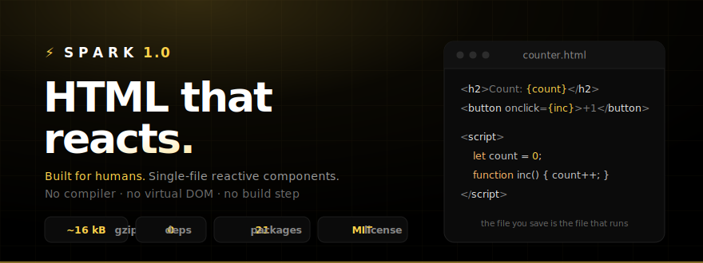

<p align="center">
  
</p>

<p align="center">
  <a href="https://www.npmjs.com/package/spark-html"></a>
  
  
  <a href="https://github.com/wilkinnovo/spark/blob/main/LICENSE"></a>
  &middot; <a href="https://wilkinnovo.github.io/spark/">site</a>
  &middot; <a href="https://wilkinnovo.github.io/spark/docs">docs</a>
</p>

---

The component **is** the file. Save `counter.html` and the browser runs it
byte-for-byte — reactive, scoped, untouched.

```html
<!-- counter.html -->
<h2>Count: {count}</h2>
<button onclick={inc}>+1</button>

<script>
  let count = 0;
  function inc() { count++; }
</script>
```

No compiler generates code from your template. No virtual DOM allocates and diffs
a tree per frame. The file you write is what runs — 11 kB gzipped, zero dependencies.

## Quick start

```bash
npx create-spark-html-app myapp
cd myapp && npm install && npm run dev
```

…or add it to an existing project:

```js
// vite.config.js
import spark from 'spark-html/vite';
export default { plugins: [spark()] };

// main.js
import { mount } from 'spark-html';
mount();
```

```html
<!-- index.html -->
<div import="components/counter"></div>
```

…or **no build at all** — straight from a CDN, no npm, no bundler:

```html
<script type="importmap">
  { "imports": { "spark-html": "https://esm.sh/spark-html@0.23" } }
</script>
<div import="components/counter"></div>
<script type="module">import { mount } from 'spark-html'; mount()</script>
```

Serve any static folder and open it — that's the whole toolchain. Components are
just files at a URL, so you can even `import` one straight from a CDN. See
[`examples/no-build`](examples/no-build).

## Performance

- **Components ship as authored HTML** — no compiler generates code from your
  template. The file you write is what runs.
- **No virtual DOM** — patches mutate the DOM directly. No intermediate tree to
  allocate, diff, or discard per frame.
- **11 kB gzipped, zero dependencies** — parses, mounts, and patches in a single
  microtask.
- **O(changed) dependency tracking** — each binding records which scope keys it
  reads. A write re-evaluates only the bindings that actually changed.

  ```html
  <p>{a} + {b} = {a + b}</p>
  <p>{c}</p>
  <script>let a = 1, b = 2, c = 3;</script>
  ```

  Updating `a` re-evaluates `{a}` and `{a + b}`. The `{c}` binding is skipped.

- **Row-level loop patching** — mutating one item re-walks only that row:

  ```html
  <template each="todo in todos" key="todo.id">
    <p>{todo.text} — {todo.done ? '✓' : '○'}</p>
  </template>
  <script>let todos = [{ id: 1, text: 'a', done: false }, /* …999 more… */];</script>
  ```

  `todos[3].done = true` re-walks only row index 3 — the other 999 rows are
  untouched. A structural change (push, splice, re-sort) still re-reconciles but
  skips rows whose identity (key) didn't move.
- **Tracked `Map`/`Set` mutations** — `map.set(key, val)`, `set.add(item)`, and
  `delete`/`clear` trigger re-renders, just like array push and object property
  assignment. No special API or immutability discipline required.

## Limits

- **One reactive scope per component** — all top-level `let`/`function` declarations share a single proxy scope within each component.
- **`let`/`const` inside functions** — plain declarations (`let x = 1`) still hoist to component scope. Destructuring (`let {a} = obj`) stays block-local.
- **Class instances / `Date`** — not deeply reactive (intentional). Reassign the variable to trigger an update. Plain objects, arrays, `Map`, and `Set` are all tracked.
- **Loops reconcile by index by default** — add `key="…"` for identity-stable reordering (keeps focus, preserves element state).
- **CSP** — the runtime uses `new Function` for expressions and event handlers, so a strict Content Security Policy needs `unsafe-eval`.

## How it works

1. **`mount()`** finds `<div import="…">` placeholders and fetches each file.
2. **Text-level extraction** — `<script>` and `<style>` are extracted from the
   raw text before the markup ever touches `innerHTML`. Browsers strip `<script>`
   tags injected via `innerHTML`; text-level extraction sidesteps the entire class
   of bugs that every other client-only framework has to work around.
3. **The script runs inside a `Proxy` scope** — every assignment schedules a
   patch of only that component's DOM. Patches are batched onto a single microtask.
4. **Cheap patches** — static subtrees (no bindings) are walked once and then
   skipped. A patch costs work proportional to *dynamic* nodes, not the whole tree.
5. **Deep reactivity** — plain objects and arrays read from scope are wrapped in
   proxies so `todos.push(x)` and `row.done = true` re-render without replacing
   the value. `Map` and `Set` mutations are tracked too.
6. **Styles are auto-scoped** via a `[name="component"]` prefix. `@media`/`@supports`
   scope correctly, `@keyframes`/`@font-face` pass through, `:global(…)` opts out.
7. **Loops reconcile by key** — each item keeps its DOM nodes across updates
   (matched by index, or by `key`), so inputs inside loops keep focus.
8. **A cloak style** hides components via `visibility:hidden` until booted and
   patched — no flash of raw `{braces}` or unstyled markup.

## Packages

**Runtime**

| Package | What it does |
|---|---|
| [`spark-html`](packages/spark/README.md) | The runtime — `mount()`, components, reactivity, `store`/`derived`, `bind:form`, scoped styles. 11 kB gzip, 0 deps. |

**Optional sibling packages** (add only what you use)

| Package | What it does |
|---|---|
| [`spark-html-router`](packages/spark-html-router/README.md) | Declarative routing — `<template route>` + `router()`, active links, a reactive `route` store. |
| [`spark-html-theme`](packages/spark-html-theme/README.md) | One-line dark/light/system theming — `theme()`, persisted, no flash. |
| [`spark-html-head`](packages/spark-html-head/README.md) | Reactive document `<title>`/`<meta>` per route — one line, 0 deps. |
| [`spark-html-motion`](packages/spark-html-motion/README.md) | Declarative enter/leave transitions — `transition="fade\|slide\|scale"` on if/each blocks. |
| [`spark-html-query`](packages/spark-html-query/README.md) | Declarative async data — a self-fetching reactive store (`loading`/`error`/`data`/`refetch`). |
| [`spark-html-persist`](packages/spark-html-persist/README.md) | Persist a store across reloads in one line — hydrate from localStorage, save on change. |
| [`spark-html-devtools`](packages/spark-html-devtools/README.md) | In-page devtools panel — live store state, component tree, patch counter, re-render flash. |

**Build &amp; tooling**

| Package | What it does |
|---|---|
| [`spark-prerender`](packages/spark-prerender/README.md) | Build-time SEO prerender — real HTML per route, no SSR server, no app changes. |
| [`prettier-plugin-spark`](packages/prettier-plugin-spark/README.md) | Prettier plugin — formats the `<script>`/`<style>` blocks, leaves markup byte-for-byte. |
| [`create-spark-html-app`](packages/create-spark-html-app/README.md) | Scaffold a Vite + spark-html app — `npm create spark-html-app`. |

## This repo

```
packages/        spark-html + the sibling/tooling packages (& create-spark-html-app)
examples/basic   a minimal Vite app consuming spark-html
website/         the showcase + docs site — built with Spark, the router & theme
```

```bash
npm install      # links workspaces
npm run dev      # the example app
npm run site     # the website
npm test         # 195+ assertions, pure node, no browser
```

Built something with Spark? Add it to the
[showcase](https://wilkinnovo.github.io/spark/showcase) — open a PR.

## License

MIT
