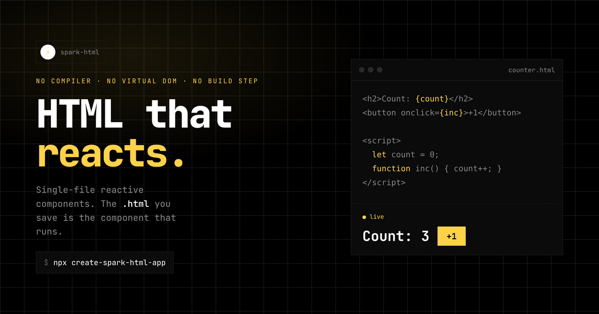

# Spark Brand & Website Upgrade — Design Plan

> Status: **APPROVED — direction locked** (awaiting go-ahead to start; do not
> begin execution until told). Tagline: **"HTML that reacts."**
> Approved visual reference: **`mock.html`** (repo root) — dark + light verified.

## 1. Vision

Re-skin the Spark brand around the novo.ws aesthetic: **monospace, dark-first,
hairline-minimal, single-accent.** Drop the current violet "marketing landing"
look (orbs, twinkling sparkles, breathing glows, gradient-shimmer text, emoji
cards) for a calm, engineered feel that matches what Spark *is* — plain files,
no magic.

**The fusion:** novo.ws gives the **shell** (mono type, dark surfaces, hairline
borders, left rail, theming). nextjs.org gives the **content patterns** (a
headline + copyable CLI + dual CTA hero, a bento feature grid, a "built with
Spark" showcase gallery, metric chips, a footer that doubles as nav). Result:
minimal and engineered like novo, but with the proven dev-tool marketing beats
of Next — no clip-art, no heavy animation.

Two wins beyond looks:
- **Dogfood our new packages.** The site becomes a `spark-html-router` SPA with a
  novo-style left sidebar, and uses `spark-html-theme` for the dark/light toggle.
  The website itself becomes the best demo of the router + theme helper.
- **Repo-grade README banner** rendered from a real Spark page (HTML → PNG), so
  the banner is on-brand, crisp, centered, and reproducible.

## 2. Brand decision: structure from novo, accent from Spark

novo.ws is monochrome with a **bitcoin-orange** highlight (`#f7931a`). Spark's
identity is the **⚡ amber/gold**. Recommendation:

- Adopt novo's **neutral structure** verbatim (mono type, dark surfaces, hairline
  borders, left sidebar, light/dark theming).
- Keep **Spark amber `#ffd24a` as the one accent on BOTH themes** — it's the logo
  color; no darker light-mode variant.
- **Light theme background is pure white `#fff`** (no off-white/grey wash);
  hairline borders do the separating.
- The **⚡ spark icon is always `#ffd24a`** (dark and light).
- Everything else stays neutral (white/black/greys). One accent, used sparingly
  (active nav, the live-demo highlight, inline `code`).

> **Open decision A:** amber accent (recommended) vs. fully monochrome (accent =
> text color, like novo's `--accent: #fff/#000`) vs. keep orange. See §9.

## 3. Design tokens (proposed `:root`)

Ported from novo, with Spark amber. Lives in the site's global `<style>` (and is
the basis for `create-spark-html-app`'s default theme later).

```
Dark (default)            Light (soft, nextjs-style — bg white, gentle greys)
--bg            #000      #ffffff
--surface       #0a0a0a   #fafafa     (cards/sidebar: faint off-white, blends)
--surface-2     #101014   #f4f4f5
--border        #1a1a1a   #ededed     (hairlines, very light)
--border-strong #333333   #d4d4d4
--text          #ffffff   #1a1a1a     (near-black, not stark)
--muted         #888888   #666666
--muted-dim     #555555   #999999
--accent        #ffffff   #111111     (structural: active text, buttons)
--spark         #ffd24a   #ffd24a     (brand amber; the ⚡ — same on both)
--sk-dark/mid/light  shimmer greys (as novo)
--font  "JetBrains Mono", ui-monospace, monospace
--sidebar-w  80px (desktop rail) / full-width top bar on mobile
--radius 0  (novo uses sharp corners; crisper than today's 12px)
```

Type: **JetBrains Mono** everywhere (already the novo font), weights 300–800.
Loaded via the existing Google Fonts `<link>`. Tight tracking on headings
(`letter-spacing: -0.02em`), uppercase mono micro-labels for section eyebrows.

No-flash theme: inline `<head>` snippet (from `spark-html-theme`'s
`themeInitScript`) sets `data-theme` before paint.

## 4. Layout — novo left rail

Replace the sticky top `nav` with novo's **fixed 80px left sidebar**:

```
┌──────┬───────────────────────────────────────────┐
│  ⚡   │                                           │
│      │                                           │
│ Home │   <route content>                         │
│ Docs │                                           │
│ Play │                                           │
│  ⓖ   │                                           │
│      │                                           │
│ SPARK│                                           │
│ ©2026│                                           │
└──────┴───────────────────────────────────────────┘
```

- **Top:** ⚡ logo mark (circular, like novo) — click toggles theme via
  `spark-html-theme` (`onclick="{theme.toggle}"`).
- **Middle:** vertical rotated nav links (novo's `transform: rotate(90deg)`),
  active link via the router's `aria-current="page"` (pure CSS, zero wiring).
- **Bottom:** small "SPARK" wordmark + `© year`, and a GitHub glyph link.
- **Mobile (≤768px):** sidebar collapses to a top bar + hamburger drawer
  (novo's exact pattern, reusable).

## 5. Information architecture (routes)

Convert the site to a `spark-html-router` SPA. Prerendered to one HTML file per
route (SEO) by `spark-prerender` — which it already supports.

| Route        | Purpose | Built from (reuse) |
|--------------|---------|--------------------|
| `/`          | Next-style hero (tagline + live counter + copyable `npx` + dual CTA), bento "why" grid, metric chips, get-started, showcase teaser | hero (rebuilt), features (trimmed→bento), quickstart (trimmed) |
| `/docs`      | Full documentation | docs-body (restyled) |
| `/playground`| The interactive editor + a couple of live demos | playground, store-demo, composition-demo (consolidated) |
| `/showcase`  | Gallery of sites built with Spark (see §10) | new component |

`<template route>` blocks in `index.html`; `router()` in `main.js`. Base path
stays `/spark/` for GitHub Pages (pass `router({ base: '/spark' })`). Left rail
nav items: **Home · Docs · Playground · Showcase** (+ GitHub glyph).

> **Open decision B:** 4 routes (Home/Docs/Playground/Showcase, recommended) vs.
> fold Playground demos into Home (3 routes). Showcase stays either way.

## 6. Section-by-section: cut / keep / restyle

**Cut (clutter):**
- Hero: orbs (`.orb-a/.orb-b`), twinkling `✦/✧` sparkles, `breathe` glow,
  gradient-`shimmer` heading. Replace with a still, confident hero.
- features: emoji icons (📄⚡🧩🌐🎨📦) → none, or a single hairline `⚡` marker.
  Trim 6 → 4 cards (single-file, surgical reactivity, stores, one tiny package).
- philosophy: drop the "receipts" block; keep the one-line thesis. Fold the
  best "compare" row into Home, move the rest into Docs intro or cut.
- site-nav (top bar) → deleted, replaced by the left rail.
- Decorative gradients/box-shadows generally; novo uses flat surfaces + hairlines.

**Keep, restyle to tokens:**
- The **live counter** hero demo (the core proof) — front and center, novo card.
- **playground** (interactive editor) — the showcase; give it the Playground route.
- **docs-body** — restyle code blocks, headings, tables to mono/hairline.
- One **store demo** (writer/reader) to show shared state — on Playground.

**Add:**
- A short, honest "what it costs" line (bundle size, no build) as a mono stat row,
  novo-stat style (like the About page's 12+/100%/∞).

## 7. README banner (new, centered, on-brand)

Goal: a crisp centered banner that reads as a real product, not clip-art.

Approach (reproducible, no external tools):
1. Author `website/public/banner.html` — a 1280×640 Spark page: black bg, subtle
   hairline grid, big ⚡, **"HTML that reacts."** in JetBrains Mono, a one-line
   sub ("Single-file reactive HTML components. No compiler. No virtual DOM. No
   build step."), and a tiny `counter.html` code snippet motif + amber accent.
2. Render it headless (Chromium screenshot at 2× = 2560×1280) → `assets/banner.png`
   committed to the repo (e.g. `website/public/og.png` doubles as the OG image).
3. README top:
   ```md
   <p align="center">
     
   </p>
   <p align="center"><b>HTML that reacts.</b> — single-file reactive components, no build step.</p>
   <p align="center"><!-- npm / license / size badges, centered --></p>
   ```
4. Reuse the same render as the social **OG image** (`og.png`) referenced from
   `<meta property="og:image">`.

> **Open decision C:** banner art direction — (i) wordmark + tagline only
> (cleanest), (ii) tagline + the counter code/preview split (shows the product),
> (iii) tagline + animated-looking spark motif. Recommended: (ii), still frame.

## 8. README cleanup

- Lead with the banner + one-line pitch + centered badges (npm version, license,
  bundle size, tests).
- Replace the big ASCII repo tree with a 4-line "what's inside" list (link each
  package to its README). Move the full tree lower or drop it.
- Tighten: one **Quick start** (`npx create-spark-html-app`), one **Use in your
  project** snippet, then links to the four packages
  (`spark-html`, `spark-html-router`, `spark-html-theme`, `spark-prerender`).
- Add the new packages (router/theme) to the ecosystem section — currently the
  README never mentions them.

## 9. Borrowed from nextjs.org (reconciled with novo minimalism)

Adopt the *content beats*, render them in the novo mono/hairline style (no blue,
no glossy cards — amber accent + flat surfaces):

- **Hero = headline + code, no image.** "HTML that reacts." + a copyable
  `npx create-spark-html-app` command (with a click-to-copy button, mono) + dual
  CTAs: **Get started** (→ /docs) and **Playground** (→ /playground). Keep the
  live counter beside it as the "this is the real component" proof.
- **Bento feature grid** for "What's in Spark" — 4–6 hairline cards (no emoji),
  each: title + one line + a link into the docs anchor. Subtle hover (border
  brightens to `--border-strong`), no shadows.
- **Metric chips** (Next's "testimonials with numbers", novo's stat row): e.g.
  `~0 build step` · `<Xkb` runtime · `N tests` · `0 deps` — mono, hairline,
  honest. Real numbers only.
- **"Foundation of…" triple** → a small row: *no compiler · no virtual DOM · no
  build step* (we already say this; make it a structured 3-up).
- **Footer as secondary nav** (lighter than Next's 4 columns): brand + the four
  package links + GitHub/npm + MIT + "built with Spark". One row, not four.
- **Docs polish:** a ⌘K-style search is a *later* nice-to-have; for now a clean
  left-rail + in-page TOC. Note it as a backlog item, don't block on it.
- **Restraint markers to copy:** generous whitespace, max-width content column,
  no autoplay/heavy motion, dark mode first-class, copyable CLI. These match
  novo already — Next just confirms the direction.

What we deliberately *don't* copy from Next: enterprise/sales framing, template
marketplace, company-logo carousel of Fortune-500s (we use a real Spark showcase
instead, §10), multi-column mega-footer.

## 10. Showcase — "Built with Spark"

A gallery proving Spark ships real sites (Next's social-proof beat, done with
*our* sites). Its own route `/showcase` + a 3-card teaser on Home.

**Seed entries:**
- **novo.ws** — Novo design studio (router + theme + prerender; the reference
  implementation).
- **spark site itself** — "this site is built with Spark" (meta-proof; novo had
  the same line).
- Placeholders / "add yours" for future entries.

**Card design:** screenshot thumbnail (2:1, novo project-card style with the
shimmer-then-image load), site name, one-line description, tags (e.g.
`router` `theme` `prerender`), link out. Grid like novo's projects page.

**Data source:** a small `showcase` store (array of `{ name, url, slug, tags,
desc }`) — same pattern as novo's `projects` store. Thumbnails captured once
(headless screenshot) into `website/public/showcase/<slug>.webp`.

**Contributions:** a short "Add your site" note → submit a PR adding an entry +
screenshot (keeps it real, zero backend). Link from the Showcase page.

> **Open decision F:** Showcase as its own route (recommended) vs. just a Home
> section. And: which sites seed it beyond novo.ws + this site?

## 11. Locked decisions ✓ (approved via mock.html)

- **A. Accent:** ✅ **Spark amber `#ffd24a` on both themes** (no darker light
  variant). Light bg is pure **white `#fff`**. The ⚡ icon is `#ffd24a` always.
- **B. Routes:** ✅ **4 routes** — Home / Docs / Playground / Showcase (left rail).
- **C. Banner art:** ✅ **tagline + code-preview split**, still frame, rendered
  HTML → PNG; reused as OG image.
- **D. Theme:** ✅ **dark-first + toggle** via `spark-html-theme` (logo = ⚡),
  no-flash inline init.
- **E. Dogfood scope:** ✅ **full router + theme SPA**, prerendered per route.
- **F. Showcase:** ✅ **own `/showcase` route + 3-card Home teaser**; seeds
  **novo.ws** + **this site** (+ "add yours via PR").
- **G. Hero:** ✅ **copyable `npx create-spark-html-app` + metric chips** beside
  the live counter. Metric numbers must be REAL (measure runtime size, test
  count, deps at build time — mock placeholders `~6kb`/`140+` are not final).

Visual language is **frozen to `mock.html`**: JetBrains Mono, 80px left rail,
rotated nav, flat surfaces, sharp corners (`--radius:0`), hairline dividers,
single amber accent, generous whitespace.

## 12. Execution order (once decided)

1. Tokens + global styles + JetBrains Mono + no-flash theme (foundation).
2. Left sidebar component (logo+theme toggle, rotated nav, footer, mobile drawer)
   — ported/generalized from novo.
3. Router IA: `<template route>` in index.html, `router()` + `theme()` in main.js;
   prerender auto-detects routes.
4. Rebuild Home (Next-style hero + bento + metric chips + showcase teaser),
   restyle Docs, build Playground; delete dead components (orbs/sparkle hero,
   top nav, receipts).
5. Build Showcase route + `showcase` store; capture thumbnails (novo.ws + this
   site) → `website/public/showcase/*.webp`.
6. Banner + OG render → `website/public/{banner,og}.png`.
7. Rewrite README (banner, badges, trimmed tree, 4 packages, showcase link).
8. Verify: build + prerender all routes, browser pass (nav active state, theme
   toggle, demos, showcase), screenshots light+dark, Lighthouse sanity. Then
   commit/deploy.

## 13. Risks / notes

- GitHub Pages base path `/spark/` — router `base` + prerender must agree.
- Amber `#ffd24a` on white is low-contrast — by explicit choice it's used for
  display/accent only (headings, chips, icon), never small body text or links.
- Keep the site a true dogfood: every section a Spark component (as today).
- Banner PNG must be committed (binary) — keep it reasonably sized (<300KB).
